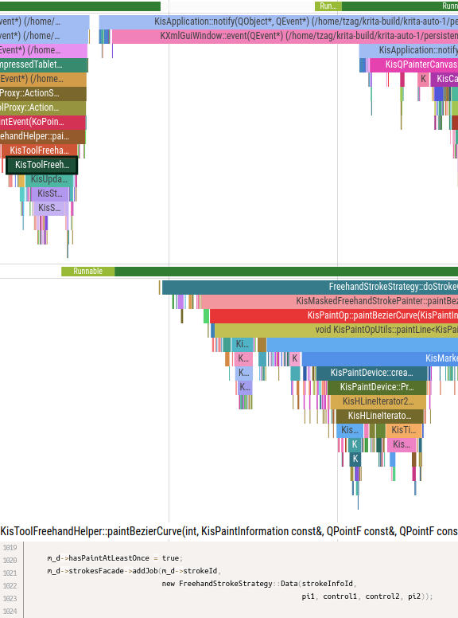

# funtrace - a C++ function call tracer for x86/Linux

A function call tracer is a kind of profiler showing **a timeline of function call and return events**. Here's an example trace captured by funtrace from [Krita](https://krita.org):



Here we can see 2 threads - whether they're running or waiting, and the changes to their callstack over time - and the source code of a selected function.

Unlike a sampling profiler such as perf, **a tracing profiler must be told what to trace** using some runtime API, and also has a **higher overhead**
than the fairly low-frequency sampling of the current callstack a-la perf. What do you get in return for the hassle and the overhead (and the hassle of culling
the overhead, by disabling tracing of short functions called very often)? Unlike flamegraphs showing where the program spends its time on average,
traces let you **debug cases of unusually high latency**, including in production (and it's a great idea to collect traces in production, and not just during development!)

For a long read about why tracing profilers are useful and how funtrace works, see [Profiling in production with function call traces](https://yosefk.com/blog/profiling-in-production-with-function-call-traces.html).
What follows is a shorter funtrace user guide.

# Why funtrace?

* **Low overhead tracing** (FWIW, in my microbenchmark I get <10 ns per instrumented call or return -
  6 times faster than an LLVM XRay microbenchmark with "flight recorder logging" and 15-18 times faster than "basic logging")
* Supports **threads, shared libraries and exceptions**
* Supports ftrace events, showing **thread scheduling states** alongside function calls & returns, so you see when time is spent waiting as opposed to computing
* Works with **stock gcc or clang** - no custom compilers or compiler passes
* Easy to integrate into a build system, and even easier to **try *without* touching the build system** using tiny compiler-wrapping scripts “passing all the right flags”
* Small (just ~1K LOC for the runtime) and thus:
  * **easy to port**
  * **easy to extend** (say, to support some variant of “green threads”/fibers)
  * **easy to audit** in case you’re reluctant to add something intrusive like this into your system without understanding it well (as I personally would be!)
* **Relatively comprehensive** – it comes with its own **tool for finding and cutting instrumentation overhead** in test runs too large to fully trace;
  support for remapping file paths to locate debug information and source code; a way to **extract trace data from core dumps**, etc.

# Trying funtrace

You can clone the repo, build the trace decoder, compile & run a simple example program, and decode its output traces as follows:

```
git clone https://github.com/yosefk/funtrace
cd funtrace
./simple-example/build.sh
./simple-example/run.sh
```

This is actually 4 different instrumented builds - 2 with gcc and 2 with clang; funtrace supports 2 different instrumentation methods for each compiler,
and we'll discuss below how to choose the best method for you. You can view the traces produced from the simple example above as follows:

```
pip install viztracer
rehash
vizviewer out/funtrace-fi-gcc.json
vizviewer out/funtrace-pg.json
vizviewer out/funtrace-fi-clang.json
vizviewer out/funtrace-xray.json
```

Funtrace uses [viztracer](https://github.com/gaogaotiantian/viztracer) for visualizing traces, in particular because of its ability to show source code, unlike stock [Perfetto](https://perfetto.dev/) (the basis for vizviewer.)

To build your own program with tracing enabled, you can use `compiler-wrappers/funtrace-pg-g++`, `compiler-wrappers/funtrace-finstr-clang++` or the other two compiler wrapper scripts, just like `simple-example/build.sh` does.
If the program uses autoconf/configure, you can set the `$CXX` env var to point to one of these scripts, and if it uses cmake, you can pass `-DCMAKE_CXX_COMPILER=/your/chosen/wrapper` to cmake.

Note that the compiler wrappers
slow down the configuration stage, because they compile & link funtrace.cpp, and this is costly at build system config time if the build system compiles many small programs to test for compiler features, library availability and such.
For the build itself, the overhead of compiling funtrace.cpp is lower, but might still be annoying if you use a fast linker like mold and are used to near-instantaneous linking. The good thing about the compiler wrappers is that
they make trying funtrace easy; if you decide to use funtrace in your program, however, you will probably want to pass the required compiler flags yourself as described below, which will eliminate the build-time overhead of the
compiler wrappers.

Once the program compiles, you can run it as usual, and then `killall -SIGTRAP your-program` (or `kill -SIGTRAP <pid>`) when you want to get a trace. The trace will go to `funtrace.raw`; if you use SIGTRAP multiple times, many
trace samples will be written to the file. Now you can run `funtrace2viz` the way `simple-example/run.sh` does; you should have it compiled if you ran `simple-example/build.sh` or just `cargo build` (the trace decoder is a Rust
program.) funtrace2viz will produce a vizviewer JSON file from each trace sample in funtrace.raw, and you can open each JSON file in vizviewer.

If you build the program, run it, and decode its trace on the same machine/in the same container, life is easy. If not, note that in order for funtrace2viz to work, you need the program and its shared libraries to be accessible at the paths where they were loaded from _in the traced program run_, on the machine _where funtrace2viz runs_. And to see the source code of the functions (as opposed to just function names), you need the source files to be accessible on that
machine, at the paths _where they were when the program was built_. If this is not the case, you can remap the paths using a file called `substitute-path.json` in the current directory of funtrace2viz, as described below.
As a side note, if you don't like having to remap source file paths - not just in funtrace but eg in gdb - see [refix](https://github.com/yosefk/refix) which can help to mostly avoid this.

Note that if you choose to try XRay instrumentation (`compiler-wrappers/funtrace-xray-clang++`), you need to run with `env XRAY_OPTIONS="patch_premain=true"` like simple-examples/run.sh does. With the other instrumentation options,
tracing is on by default.

**TODO** binary releases of the decoding tools

The above is how you can give funtrace a quick try. The rest tells how to integrate it in your program "for real."

# Choosing compiler instrumentation

Funtrace relies on the compiler inserting hooks upon function calls and returns. Funtrace supports 4 instrumentation methods (2 for gcc and 2 for clang), and comes with a compiler wrapper script passing the right flags to use each:

* **funtrace-finstr-g++** - gcc with `-finstrument-functions`
* **funtrace-pg-g++** - gcc with `-pg -mfentry -minstrument-return=call`
* **funtrace-finstr-clang++** - clang with `-finstrument-functions`
* **funtrace-xray-clang++** - clang with `-fxray-instrument`

**"By default," the method used by funtrace-pg-g++ and funtrace-finstr-clang++ is recommended for gcc and clang, respectively**. However, for each compiler, there are reasons to use the other method. Here's a table of the methods and their pros and cons, followed by a detailed explanation:

Method | gcc -finstr | gcc -pg | clang -finstr | clang XRay
--- | --- | --- | --- | --- 
before or after inlining? | ❌ before | ✅ after | ✅✅ before or after! | ✅ after
tail call artifacts | ✅ no | ❌ yes | ✅ no | ❌ yes
untraced exception catcher artifacts | ✅ no | ❌ yes | ❌ yes | ❌ yes
control tracing by source path | ✅ yes | ❌ no | ❌ no | ❌ no
control tracing by function length | ❌ no | ❌ no | ❌ no | ✅ yes

We'll now explain these items in detail, and add a few points about XRay which "don't fit into the table."

* **Instrument before or after inlining?** You usually prefer "after" - "before" is likely to hurt performance too much (and you can use the NOFUNTRACE macro to suppress the tracing of a function, but you'll need to do this in too many places.) Still, instrumenting before inlining has its uses, eg you can trace the program flow and follow it in vizviewer - for an interactive and/or multithreaded program, this might be easier than using a debugger or an IDE. clang -finstrument-functions is the nicest here - it instruments before inlining, but has a sister flag -finstrument-functions-after-inlining that does what you expect.
* **Tail call artifacts** is when f calls g, the last thing g does is calling h, and instead of seeing f calling g _which calls h_, you see f calling g _and then h_. This happens because the compiler calls the "on return" hook from g before g's tail call to h. An annoyance if not a huge deal.
* **Untraced exception catcher artifacts** is when you have a function with a `try/catch` block _and_ tracing is disabled for it. In such a case, when an exception is thrown & caught, it looks like _all_ the functions returned and you start from a freshly empty call stack - instead of the correct picture (returning to the function that caught the exception.) This artifact comes from most instrumentation methods not calling the "on return" hook when unwinding the stack. This annoyance is avoided as long as you enable tracing for functions catching exceptions (in which case funtrace traces enough info to get around the return hook not being called upon unwinding.)
* **Control tracing by source path** - gcc's `-finstrument-functions-exclude-file-list=.h,.hpp,/usr/include` (for example) will disable tracing in functions with filenames having the substrings on the comma-separated list. This can somewhat compensate for -finstrument-functions instrumenting before inlining, and you might otherwise use this feature for "targeted tracing." 
* **Control tracing by function length** - XRay has `-fxray-instruction-threshold=N` which excludes short functions from tracing, unless they have loops that XRay assumes will run for a long time.

A few words about XRay which is its own thing:

* **XRay instrumentation was enabled in shared libraries in late 2024** and is not yet available in officially released versions. clang versions with XRay shared library support have the `-fxray-shared` flag.
* **XRay uses dynamic code patching for enabling/disabling tracing at runtime.** This is why tracing is off unless you run under `env XRAY_OPTIONS="patch_premain=true"`, or use XRay's runtime APIs to patch the code. Funtrace has its own API, `funtrace_enable/disable_tracing()`, but it deliberately _doesn't_ call XRay's code-patching APIs. Funtrace's API is a quick way to cut most of the overhead of tracing without any self-modifying code business. It's up to you to decide, if you use XRay, whether you want to cut even more overhead by using runtime patching - downsides include creating copies of the code pages, for which you might not have the extra space, and taking more time than funtrace_enable/disable_tracing().
* **Currently, funtrace's XRay support passes --allow-multiple-definition to the linker.** That's because funtrace needs to redefine XRay's on-call/on-return hooks, and there doesn't seem to be another way to do it. If XRay defines its hooks as "weak", this flag will no longer be needed.
  

# Compiling & linking with funtrace

# Runtime API for taking & saving trace snapshots

# Decoding traces

# Compile-time & runtime configuration

# Limitations

